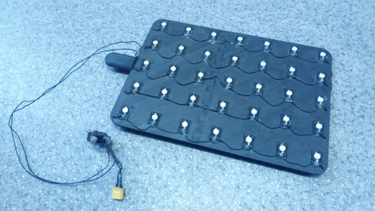
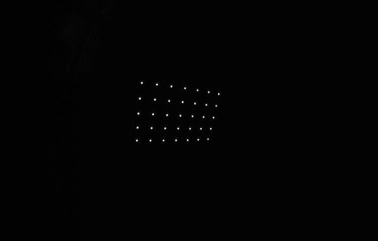
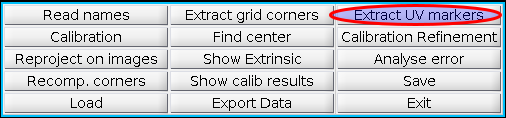

# OCamCalib_UVDAR
A modification of Davide Scaramuzza's OCamCalib Toolbox changed for calibration of UV-sensitive cameras using LED grid as calibration pattern.
The grid should be non-square, and composed of LEDs emitting in the 395nm range.
An example of such grid:



If the camera is constructed correctly, the output image of the pattern should look like this:



The tool itself is dependent on OpenCV.
To use the new functionality, you have to first build the grid extracting executable:
```
cd autoMarkerFinder
make
```

The tool itself is then used exactly as with chessboard-like calibration pattern, but instead of selecting `Extract grid corners`, select `Extract UV markers`:



The LED markers are equivalent to internal corners of the chessboard grid.


The original OCamCalib Toolbox can be found [Here](https://sites.google.com/site/scarabotix/ocamcalib-toolbox) and its underlying principles are discussed in:
<details>
<summary>D. Scaramuzza, A. Martinelli and R. Siegwart, "A Toolbox for Easily Calibrating Omnidirectional Cameras," 2006 IEEE/RSJ International Conference on Intelligent Robots and Systems, 2006, pp. 5695-5701, doi: 10.1109/IROS.2006.282372.</summary>

```
  @INPROCEEDINGS{4059340,
  author={Scaramuzza, Davide and Martinelli, Agostino and Siegwart, Roland},
  booktitle={2006 IEEE/RSJ International Conference on Intelligent Robots and Systems}, 
  title={A Toolbox for Easily Calibrating Omnidirectional Cameras}, 
  year={2006},
  volume={},
  number={},
  pages={5695-5701},
  doi={10.1109/IROS.2006.282372}}
```
</details>

